<h1>Tutorial for Redux</h1>

In this tutorial we will learn the following libraries:-

<ol>
<li>Redux</li>
<li>React-Redux</li>
<li>Redux-thunk</li>
<li>Redux-Toolkit</li>
<li>RTK Query</li>
<li>Redux Saga (Optional) </li>
</ol>

<h3>Redux:-</h3>

Redux is a powerful state management library for javascript applications ie:- React.  Some key points about Redux are:- 

<ol>

  <li>
  Predictable State Management:
   <ul>
    <li>Redux provides a predictable way to manage the state of your application.</li>
    <li>It follows a unidirectional data flow, making it easier to reason about how data changes over time.</li>
   </ul>
  </li>

  <li>
  Single Store
   <ul>
     <li>Redux maintains a single global store that holds the entire state of your application.</li>
     <li>Components can read data from this store and dispatch actions to update it.</li>
    </ul>
  </li>

  <li>
  Actions and Reducers:
   <ul>
     <li>Actions represent events or user interactions (e.g., clicking a button).</li>
     <li>Reducers are pure functions that handle these actions and update the state accordingly.</li>
    </ul>
  </li>
  
  <li>
  React-Redux Integration
   <ul>
     <li>React-Redux is the official package that connects React components with the Redux store.</li>
     <li>It allows components to read data from the store and dispatch actions to update it.</li>
    </ul>
  </li>

</ol>

Note:- We use redux to overcome the problem of prop drilling.  Before Moving Further lets agan recap the useReducer Hook.  Let's create a Component called child which will be child component of app.jsx, this component will have 4 buttons +, -, *, /, to add 1, subtract -1, to double and to half the count respectively.

Lets see How Child Component Looks Like

The Problem with this useReducer Hook is prop drilling suppose there is a child component called "a" of child.jsx and the "a" component is using this dispatch function instead of child.jsx component, so we have to send the dispatch from app to Child then Child to "a", imagine this hierachy goes very long then its a big chain of prop drilling, what if we have a global state and we can manage it from anywhere in our app without props? We can do this using Redux... 
Ques:- So when to use Redux?
 1.) Only For Big Application.
 2.) Hight frequency of State Changes:- State is changing very frequently.

The Store we are talking about has state, dispatch function and reducer function, and we already know what they are.

<h3>Redux Library</h3>

Lets First Start by redux Library, ie:- pure Redux, lets install redux using npm i redux.

We can see Redux looks like as useReducer Hook.

<h3>Middleware in Redux.</h3>

When we call dispatch function, the action object direly ges to te reducer function, what if we want to stop dispatch in between or wants to take another action between sending action to dispatch? we uses middleware for that. eg:- lets try logger middleware. lets install it using npm i logger

Lets call dispatch function and see how does this go.

Here we can see, as soon as we called the dispatch function the middleware is called automatically before passing the action object to reducer and in output the middleware is return us some info ie:- the prev state of store is {acount:1}
and the type of action is ADD and the next state of store is {amount:2}, everytime we will calle dispatch function, we will get output from logger middleware.  There are a lot more middleware eg:- thunk, this middleware delays the dispatch function call to make apis call we will see it later in detail.

Note:- Now what if we want to increament ny 5 every time and note by 1, we can do it using payload attribute in action object while callong dispatch function, eg:-

<h3>Action Creators</h3>

Now we Know that these action objects can be called by anyone, so what is someone write add instead of 'ADD' in type key of action object. eg:-   stor.dispatch({type:'add', payload:5})  there is no such type so default value will be returned by reducer, but the one who called this dispatch function will think there is some error and its not working, so to overcome this problem what if we create a function and this function will return action object so that manually no one has to write action object, this concept is called nothing but action creator. lets create action creator.

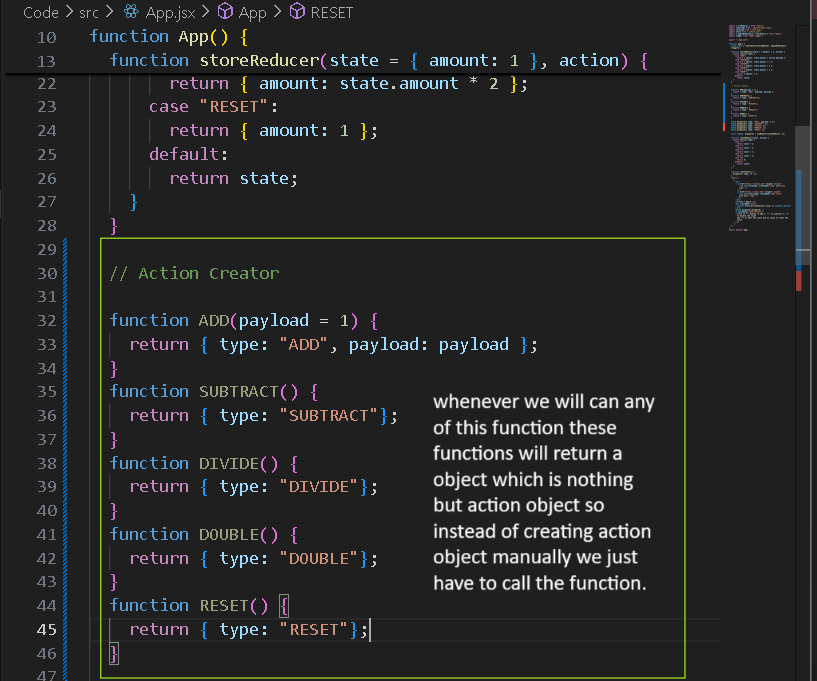
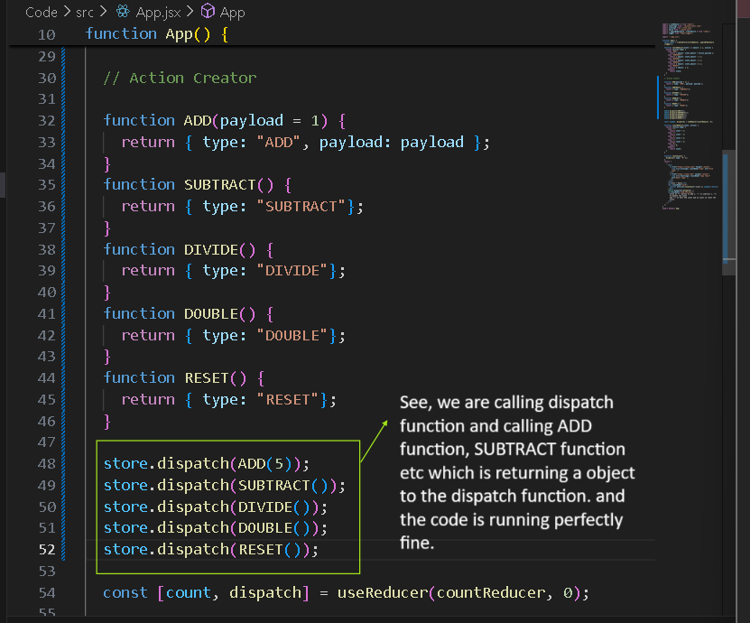

Till now we have done synchronous request, lets do some asynchronous requests, using thunk middleware, so lets see it in detail.

<h3>Thunk Middleware</h3>

Lets create a json server:- how to cerate?  create a json file eg:- db.json in src/assets/jsonserver  {
   "accounts":[ 
     {"id":1, "amount":200}, 
     {"id":2, "amount":100} 
  ] 
} and install a global dependency called json-server, ed:-   npm i -g json-server.   After installing this global dependency lets try to run json server using it

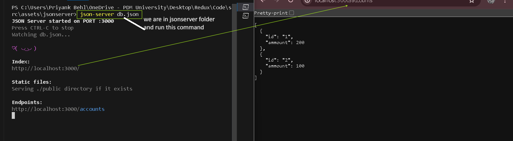

we can also do request like http://localhost:3000/accounts/1 , json server dependency will automatically take out the id from url and search it and will return the obj with id:1

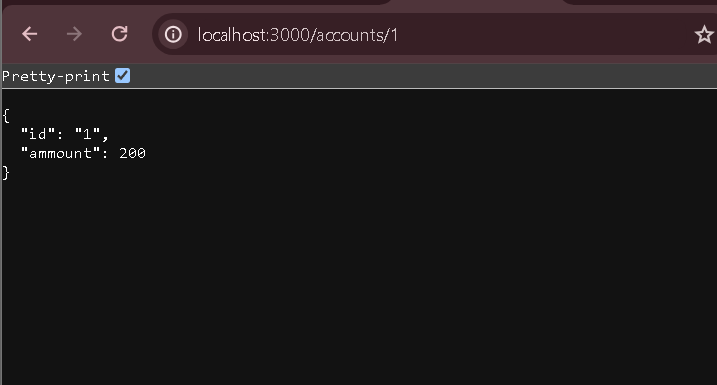

Now Lets try to, make api call in our app.jsx, for that lets install axios, and import it.

task:- till now the amount is initialized to 1 at start we dont want it, we want our starting value of amount from an api, lets try to do this task. Lets create a new action caleed initialization and also make a action creator function for it.

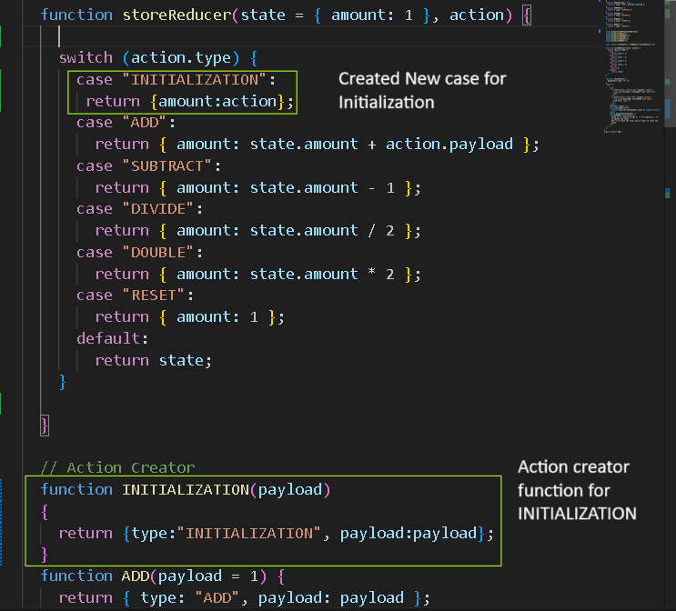

Lets call it and see if it works.

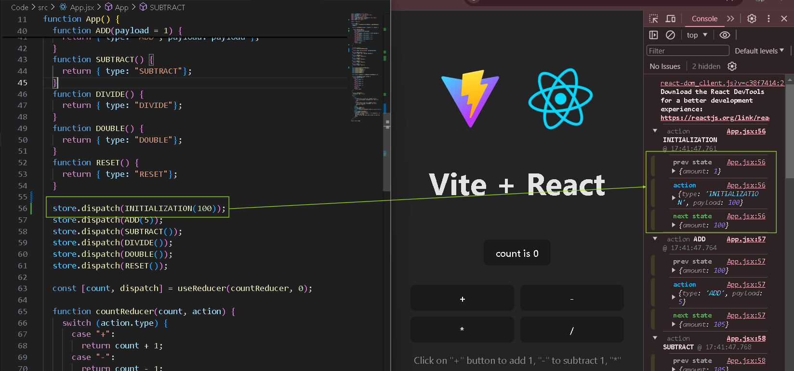

Now lets try to initialize this state using api.

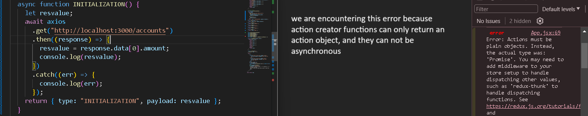

What if we can stop our program to get data from api and then we can have dispatch function in our action creator function and then from there we can call it, we can do it with a middleware called redux-thunk, Let's try.   Command is :- npm i redux-thunk Now How to use Thunk? import thunk and then add it to the applyMiddleware function which is inside the createStore function.

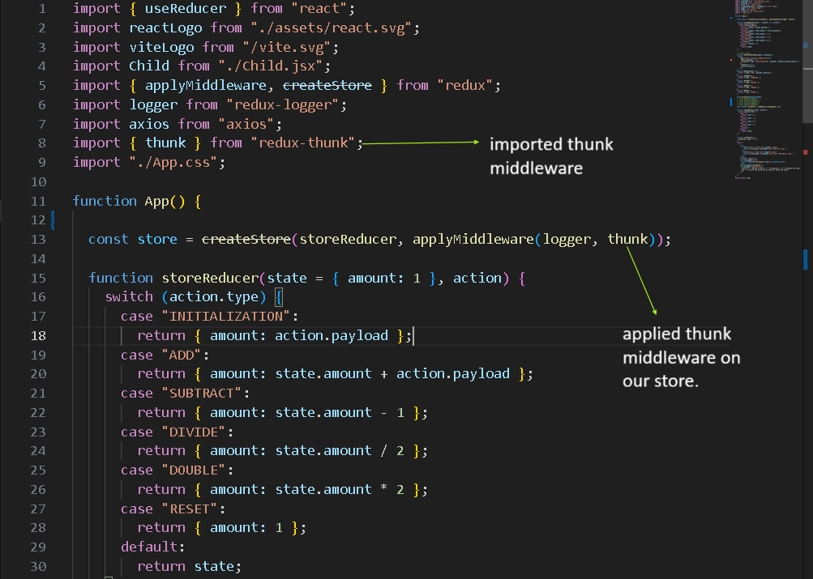

The place where we used to call our action creator using dispatch function, instead now we will not call our action creator but pass the defination of action creator to dispatch and the thunk will automatically pass the dispatch function and getstate,so now we can use dispatch in our action creator function.

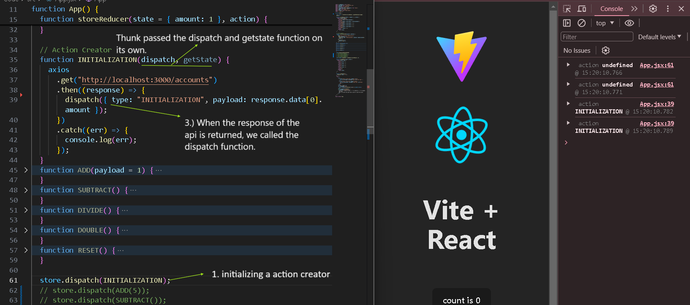

We will explore thunk a lil more later.

<h3>Multiple reducers</h3>

Now suppose we also have bonus data and not just accounts datat in our application.

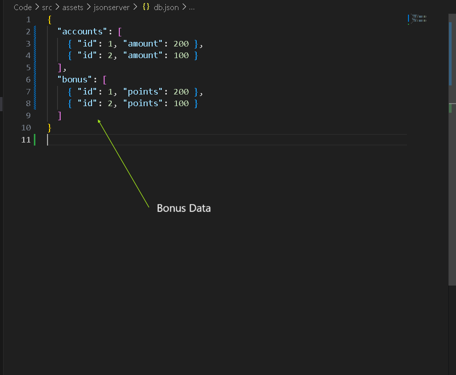

Now we have 2 options, one create another reducer for this bonus or create another field called bonus in this state. eg: state={amount:12, bonus:123} lets see bith the scenario ie:- updating the already built state, creating new reducer.

<ol type="i">
  <li>
   <h4>New variable in old state</h4>
   
We dont want to mess in our already existing code, lets create a new file called test.js and try to do this there.  src->assest->test->test.js 
   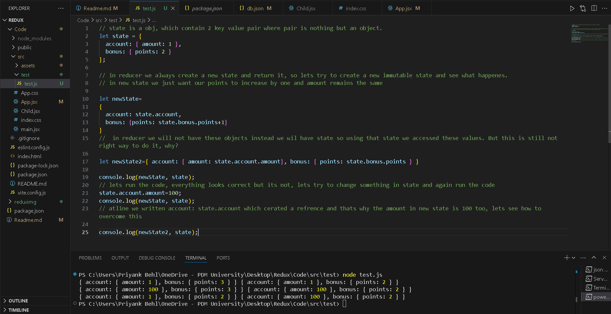
   
So this is how we have to do it, what if? there is another object inside amount key, then we have to make another copy too which will make code more complex and messy, so it is better to make a new reducer for it, lets see.

   

  </li>
  <li>
  <h4>New Reducer</h4>
  

  </li>
</ol>