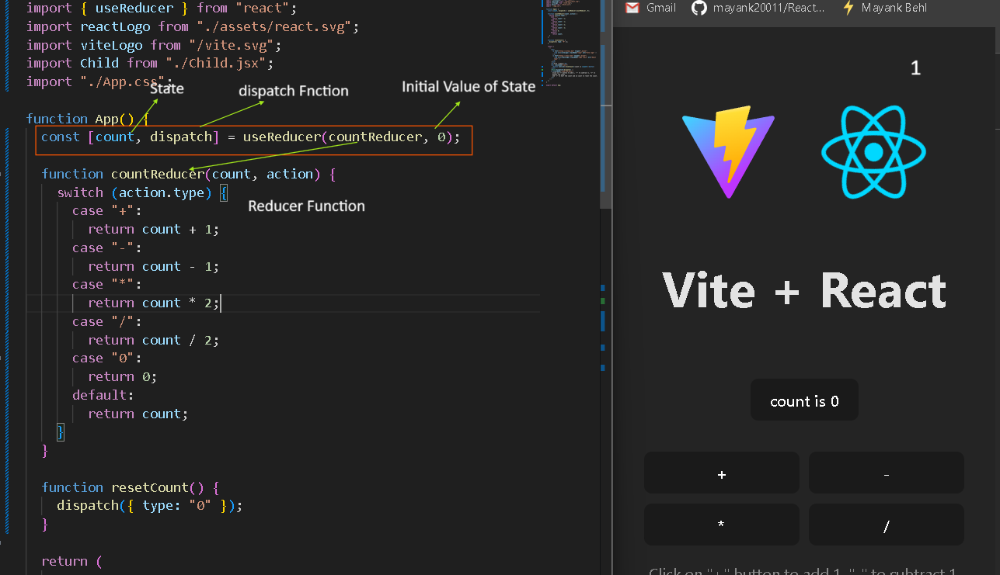
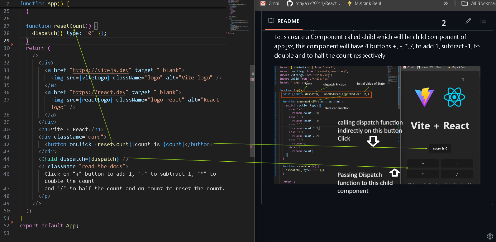
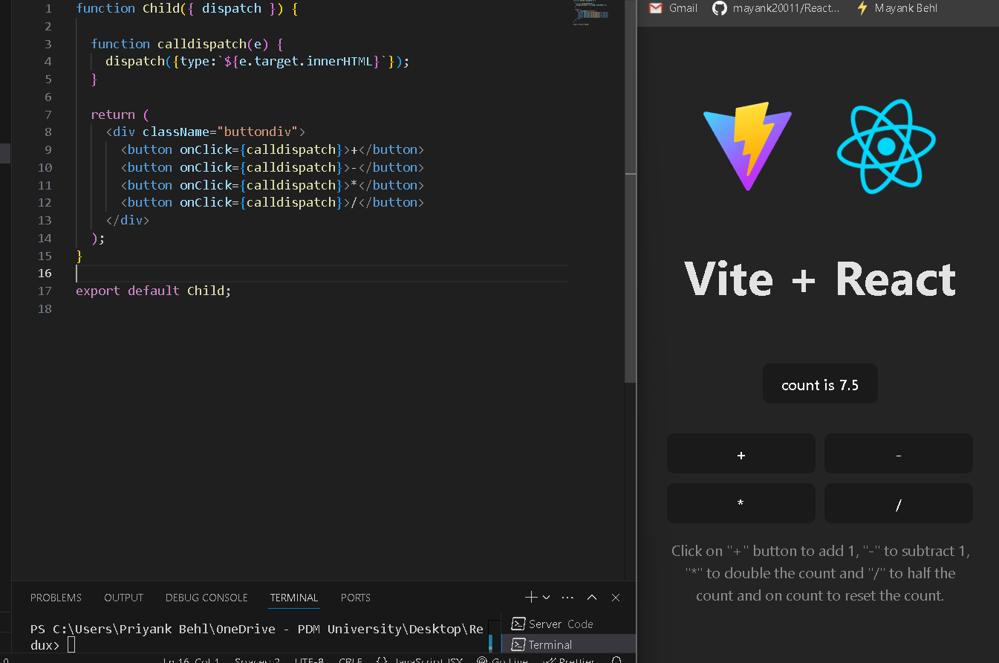
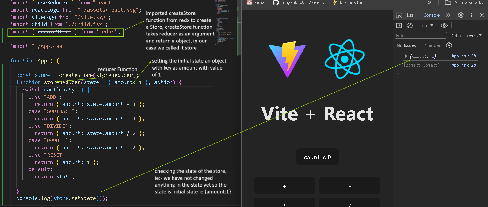
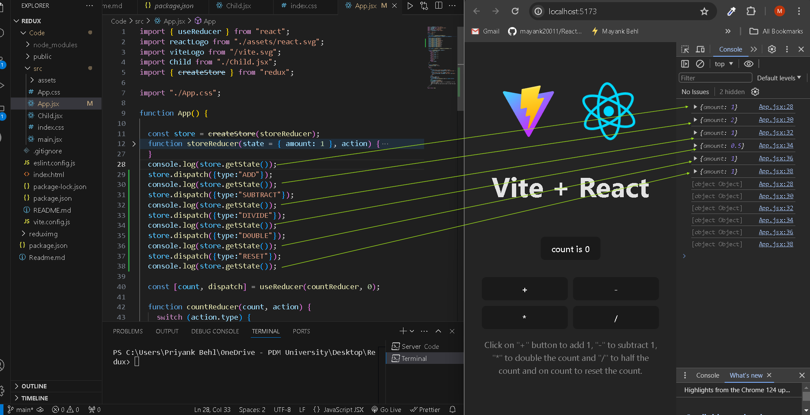
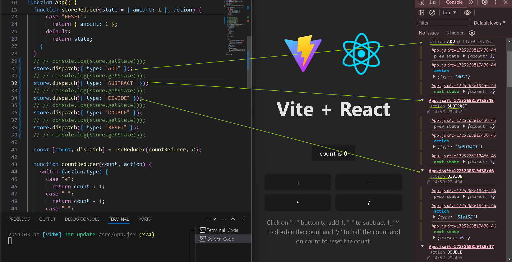
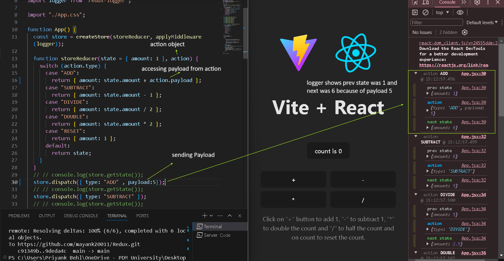

<h1>Tutorial for Redux</h1>

In this tutorial we will learn the following libraries:-

<ol>
<li>Redux</li>
<li>React-Redux</li>
<li>Redux-thunk</li>
<li>Redux-Toolkit</li>
<li>RTK Query</li>
<li>Redux Saga (Optional) </li>
</ol>

<h3>Redux:-</h3>

Redux is a powerful state management library for javascript applications ie:- React.  Some key points about Redux are:- 

<ol>

  <li>
  Predictable State Management:
   <ul>
    <li>Redux provides a predictable way to manage the state of your application.</li>
    <li>It follows a unidirectional data flow, making it easier to reason about how data changes over time.</li>
   </ul>
  </li>

  <li>
  Single Store
   <ul>
     <li>Redux maintains a single global store that holds the entire state of your application.</li>
     <li>Components can read data from this store and dispatch actions to update it.</li>
    </ul>
  </li>

  <li>
  Actions and Reducers:
   <ul>
     <li>Actions represent events or user interactions (e.g., clicking a button).</li>
     <li>Reducers are pure functions that handle these actions and update the state accordingly.</li>
    </ul>
  </li>
  
  <li>
  React-Redux Integration
   <ul>
     <li>React-Redux is the official package that connects React components with the Redux store.</li>
     <li>It allows components to read data from the store and dispatch actions to update it.</li>
    </ul>
  </li>

</ol>

Note:- We use redux to overcome the problem of prop drilling.  Before Moving Further lets agan recap the useReducer Hook.  Let's create a Component called child which will be child component of app.jsx, this component will have 4 buttons +, -, *, /, to add 1, subtract -1, to double and to half the count respectively.

Lets see How Child Component Looks Like

The Problem with this useReducer Hook is prop drilling suppose there is a child component called "a" of child.jsx and the "a" component is using this dispatch function instead of child.jsx component, so we have to send the dispatch from app to Child then Child to "a", imagine this hierachy goes very long then its a big chain of prop drilling, what if we have a global state and we can manage it from anywhere in our app without props? We can do this using Redux... 
Ques:- So when to use Redux?
 1.) Only For Big Application.
 2.) Hight frequency of State Changes:- State is changing very frequently.

The Store we are talking about has state, dispatch function and reducer function, and we already know what they are.

<h3>Redux Library</h3>

Lets First Start by redux Library, ie:- pure Redux, lets install redux using npm i redux.

We can see Redux looks like as useReducer Hook.

<h3>Middleware in Redux.</h3>

When we call dispatch function, the action object direly ges to te reducer function, what if we want to stop dispatch in between or wants to take another action between sending action to dispatch? we uses middleware for that. eg:- lets try logger middleware. lets install it using npm i logger

Lets call dispatch function and see how does this go.

Here we can see, as soon as we called the dispatch function the middleware is called automatically before passing the action object to reducer and in output the middleware is return us some info ie:- the prev state of store is {acount:1}
and the type of action is ADD and the next state of store is {amount:2}, everytime we will calle dispatch function, we will get output from logger middleware.  There are a lot more middleware eg:- thunk, this middleware delays the dispatch function call to make apis call we will see it later in detail.

Note:- Now what if we want to increament ny 5 every time and note by 1, we can do it using payload attribute in action object while callong dispatch function, eg:-

