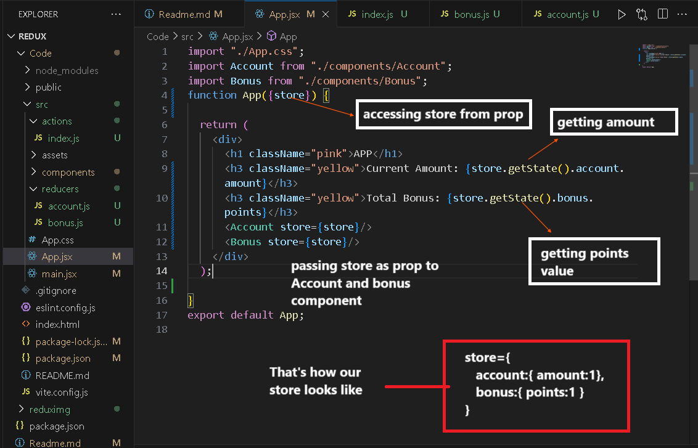

<h1>REACT-REDUX</h1>

React Redux is the official React UI bindings layer for Redux. 
It acts as the bridge between your React components and the Redux store. 
With React Redux, your components can read data from the Redux store and dispatch actions to update the state. Lets create a simple App which will have 2 child components amount and bonus, now these child components should have some functionality, we want some data to flow from chld to parent, Bonus, account to app component. lets try to do it

<ol type="i">
<li>

 <h3>By lifting state up</h3>
  
This is how our all components and ui looks like:-

  App Component
  
  Account COmponent
  
  Bonus Component
  
  
Now i want to pass this amount and point state datat to parent container so that when the amount and point changes it also get reflected in parent container too. so lets try to use the concept of lifting state up, ie:- we will declare these states in app component and try pass all the function regarding to these sates as prop, lets try to do it, and see how components looks like after making changes.

  
  Accounnt Component
  
  Bonus Component
  
  
Now this is making the code complex, what if there was child component of bonus or account and we need to access these props in that child component of bonus? then we have to send these props to bonus then bonus to its child, ie:- big prop drilling , which makes code complex. lets try to do it using redux.

</li>

<li>
<h3>Using redux</h3>

Lets Create a store for this app specifically and try to do these tasks using redux, but lets first cerate few folder, for action creators, for reducer, lwts cerate these folder in src and create files in these folders

Now lets create store, reducers, we already created action creators.

Now, we can create stores in app.jsx but we should create in main.jsx where app is called and rendered

Now lets access this store in app and use it

Now lets catch these props in child component and also use it there.

Now lets see whats inside these function

</li>
</ol>
